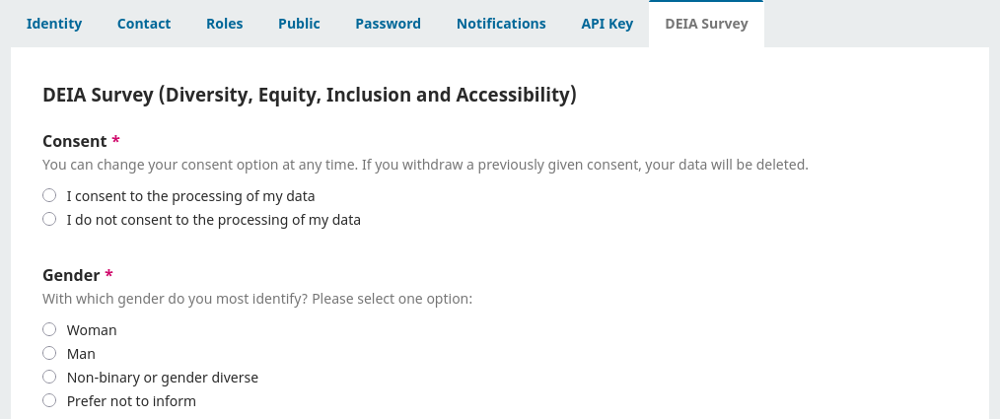

**English** | [Português Brasileiro](/docs/README-pt_BR.md)

# Demographic Data

This plugin allows the collection of demographic data from users via a questionnaire.

## Compatibility

This plugin is compatible with the following PKP applications:

- OPS and OJS versions 3.3 and 3.4.

Check the latest compatible version for your application on the [Releases page](https://github.com/lepidus/demographicData/releases).

## Plugin Download

To download the plugin, go to the [Releases page](https://github.com/lepidus/demographicData/releases) and download the tar.gz package of the latest release compatible with your OJS.

## Installation

1. Enter the administration area of ​​your application and navigate to `Settings`>` Website`> `Plugins`> `Upload a new plugin`.
2. Under __Upload file__ select the file __demographicData.tar.gz__.
3. Click __Save__ and the plugin will be installed on your OJS.

## Instructions for use
Once enabled, the demographic questionnaire is displayed in the users profile page. When accessing this page, the user will find a new tab, called "Demographic Data", where they can consent to answer the questionnaire or not.

For authors who are not registered in the system, an e-mail is sent when the submission is accepted, requesting them to fill in the demographic questionnaire. This e-mail is only sent to authors where there is no user with the same e-mail address in the system.

The e-mail sent offers two ways of filling in the data. The first requires an ORCID record to be authenticated, so that the data is associated with this record. The second uses the author's e-mail address and is recommended only for those who do not have an ORCID record.

Users can view and delete their demographic data at any time. For the authors without registration who answered the questionnaire, if they create an account in the system with the e-mail address or ORCID used, their data will be migrated to this new user.

## Credits
This plugin was sponsored by Lepidus Tecnologia, Scientific Electronic Library Online (SciELO), Revista Encontros Bibli (UFSC) and others (we'll update soon).

Developed by Lepidus Tecnologia.

## License

__This plugin is licensed under the GNU General Public License v3.0__

__Copyright (c) 2024-2025 Lepidus Tecnologia__