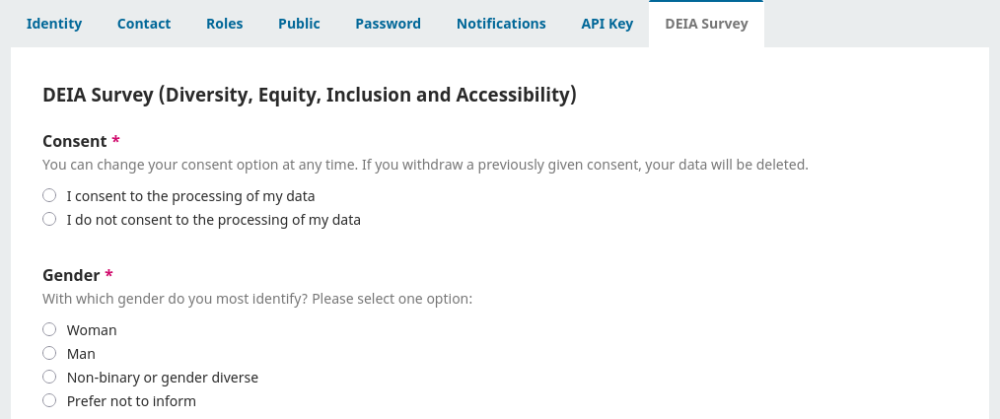

**English** | [Português Brasileiro](/docs/README-pt_BR.md)

# DEIA Survey (Diversity, Equity, Inclusion, and Accessibility)

This plugin allows the collection of DEIA data from users via a questionnaire.

## Compatibility

This plugin is compatible with the following PKP applications:

- OJS and OPS versions 3.3, 3.4 and 3.5.

Check the latest compatible version for your application on the [Releases page](https://github.com/lepidus/deiaSurvey/releases).

## Plugin Download

To download the plugin, go to the [Releases page](https://github.com/lepidus/deiaSurvey/releases) and download the tar.gz package of the latest release compatible with your OJS/OPS.

## Installation

1. Enter the administration area of ​​your application and navigate to `Settings`>` Website`> `Plugins`> `Upload a new plugin`.
2. Under __Upload file__ select the file __deiaSurvey.tar.gz__.
3. Click __Save__ and the plugin will be installed on your OJS/OPS.

## Instructions for use
Once enabled, the questionnaire is displayed in the users profile page. When accessing this page, the user will find a new tab, called "DEIA Survey", where they can consent to answer the questionnaire or not.



For authors who are not registered in the system, an e-mail is sent when the submission is accepted, requesting them to fill in the questionnaire. This e-mail is only sent to authors where there is no user with the same e-mail address in the system.

The e-mail sent offers two ways of filling in the questionnaire. The first requires an ORCID record to be authenticated, so that the data is associated with this record. The second uses the author's e-mail address and is recommended only for those who do not have an ORCID record.

Users can view and delete their data at any time. For the authors without registration who answered the questionnaire, if they create an account in the system with the e-mail address or ORCID used, their data will be migrated to this new user.

## Question block import and export

The plugin can export and import DEIA question blocks as JSON files from the question block manager in the plugin settings. Imported question blocks are created as inactive, so they can be reviewed before being displayed to users.

The JSON file must use this structure:

```json
{
  "plugin": "deiaSurvey",
  "blocks": [
    {
      "title": {
        "en": "Funding DEIA questions"
      },
      "description": {
        "en": "Questions about access to funding opportunities."
      },
      "questions": [
        {
          "questionType": "TYPE_CHECKBOXES",
          "questionText": {
            "en": "Are you a scholarship recipient?"
          },
          "questionDescription": {
            "en": "Select all funding sources that apply."
          },
          "responseOptions": [
            {
              "optionText": {
                "en": "Institutional scholarship"
              },
              "hasInputField": false
            },
            {
              "optionText": {
                "en": "Other"
              },
              "hasInputField": true
            }
          ]
        },
        {
          "questionType": "TYPE_TEXT_FIELD",
          "questionText": {
            "en": "What support do you need?"
          },
          "questionDescription": {
            "en": "Describe the support that would help your participation."
          },
          "responseOptions": []
        }
      ]
    }
  ]
}
```

Accepted `questionType` values:

- `TYPE_SMALL_TEXT_FIELD`
- `TYPE_TEXT_FIELD`
- `TYPE_TEXTAREA`
- `TYPE_CHECKBOXES`
- `TYPE_RADIO_BUTTONS`
- `TYPE_DROP_DOWN_BOX`

Text fields use localized objects, where each key is a locale code such as `en`, `en_US`, `es`, or `pt_BR`. `responseOptions` is only needed for checkbox, radio button and drop-down questions; use an empty array for text questions.

## Credits
This plugin was sponsored by Lepidus Tecnologia, Scientific Electronic Library Online (SciELO), Revista Encontros Bibli (UFSC) and others (we'll update soon).

Developed by Lepidus Tecnologia.

## License

__This plugin is licensed under the GNU General Public License v3.0__

__Copyright (c) 2024-2026 Lepidus Tecnologia__
