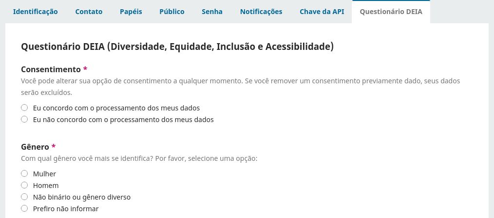

[English](/README.md) | **Português Brasileiro**

# Dados Demográficos

Este plugin permite a coleta de dados demográficos dos usuários através de um questionário.

## Compatibilidade

A última versão deste plugin é compatível com as seguintes aplicações da PKP:

* OJS 3.4.0

Utilizando PHP 8.1 ou uma versão superior.

## Download do plugin 

Para fazer download do plugin, vá até a [Página de Versões](https://github.com/lepidus/demographicData/releases) e faça download do pacote tar.gz da última versão compatível com o seu website.

## Instalação

1. Entre na área administrativa do seu site OJS através do __Painel de Controle__.
2. Navegue até `Configurações`> `Website`> `Plugins`> `Carregar um novo plugin`.
3. Em __Carregar arquivo__, selecione o arquivo __demographicData.tar.gz__.
4. Clique em __Salvar__ e o plugin será instalado no seu site.

## Instruções de uso
Assim que o plugin for ativado, o questionário demográfico será exibido na página de perfil do usuário. Ao acessar essa página, o usuário encontrará uma nova aba, chamada "Dados Demográficos", onde poderá consentir em responder o questionário ou não.

Para autores que não estiverem registrados no sistema, um e-mail será enviado quando a submissão for aceita, requisitando que estes preencham o questionário demográfico. Esse e-mail é enviado apenas para autores para os quais não há um usuário no sistema com o mesmo endereço de e-mail.

O e-mail enviado oferece duas maneiras de preencher os dados demográficos. A primeira requere que um registro ORCID seja autenticado, de forma que os dados fiquem associados a esse registro. A segunda utiliza o endereço de e-mail do(a) autor(a) e é recomendada apenas para aqueles que não possuem um registro ORCID.

Os usuários podem ver e excluir seus dados demográficos a qualquer momento. Para os autores sem cadastro que preencheram o questionário, caso estes criem um usuário no sistema com o mesmo endereço de e-mail ou ORCID utilizado, seus dados serão migrados para este novo usuário.

## Créditos
Este plugin foi patrocinado por Lepidus Tecnologia, Scientific Electronic Library Online (SciELO), Revista Encontros Bibli (UFSC) e outros (iremos atualizar em breve).

Desenvolvido por Lepidus Tecnologia.

## License

__Este plugin é licenciado sob a GNU General Public License v3.0__

__Copyright (c) 2024 Lepidus Tecnologia__