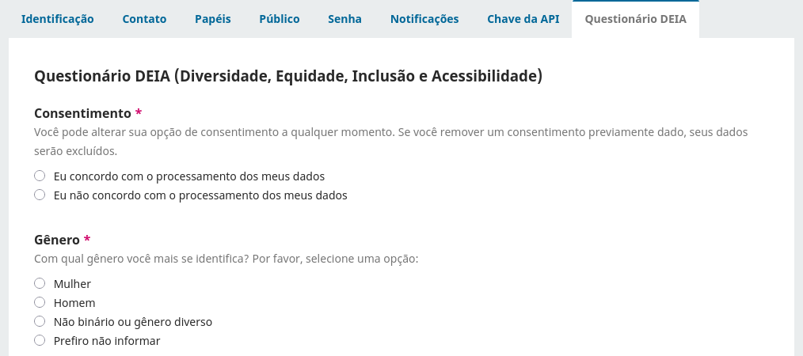

[English](/README.md) | **Português Brasileiro**

# Questionário DEIA (Diversidade, Equidade, Inclusão e Acessibilidade)

Este plugin permite a coleta de dados DEIA dos usuários através de um questionário.

## Compatibilidade

A última versão deste plugin é compatível com as seguintes aplicações da PKP:

* OJS 3.3.0
* OPS 3.3.0

Utilizando PHP 8.1 ou uma versão superior.

## Download do plugin 

Para fazer download do plugin, vá até a [Página de Versões](https://github.com/lepidus/deiaSurvey/releases) e faça download do pacote tar.gz da última versão compatível com o seu website.

## Instalação

1. Entre na área administrativa do seu site OJS através do __Painel de Controle__.
2. Navegue até `Configurações`> `Website`> `Plugins`> `Carregar um novo plugin`.
3. Em __Carregar arquivo__, selecione o arquivo __deiaSurvey.tar.gz__.
4. Clique em __Salvar__ e o plugin será instalado no seu site.

## Instruções de uso
Assim que o plugin for ativado, o questionário será exibido na página de perfil do usuário. Ao acessar essa página, o usuário encontrará uma nova aba, chamada "Questionário DEIA", onde poderá consentir em responder o questionário ou não.



Para autores que não estiverem registrados no sistema, um e-mail será enviado quando a submissão for aceita (no OJS), requisitando que estes preencham o questionário. No OPS, o e-mail é enviado quando a submissão é finalizada e quando é postada. Esse e-mail é enviado apenas para autores para os quais não há um usuário no sistema com o mesmo endereço de e-mail.

O e-mail enviado oferece duas maneiras de preencher o questionário. A primeira requere que um registro ORCID seja autenticado, de forma que os dados fiquem associados a esse registro. A segunda utiliza o endereço de e-mail do(a) autor(a) e é recomendada apenas para aqueles que não possuem um registro ORCID.

Os usuários podem ver e excluir seus dados a qualquer momento. Para os autores sem cadastro que preencheram o questionário, caso estes criem um usuário no sistema com o mesmo endereço de e-mail ou ORCID utilizado, seus dados serão migrados para este novo usuário.

## Gerenciamento de blocos de perguntas

Gerentes de revistas e servidores de preprints podem criar e manter blocos de perguntas DEIA nas configurações do plugin. Acesse `Configurações` > `Website` > `Plugins`, expanda a linha do plugin Questionário DEIA e abra `Configurações`.

Use `Criar Bloco de Perguntas` para adicionar um bloco. Cada bloco exige um título localizado e pode incluir uma descrição localizada. Depois de salvar o bloco, expanda sua linha, selecione `Editar` e abra a aba `Perguntas` para criar as perguntas exibidas dentro desse bloco.

Cada pergunta exige um texto localizado e um tipo de pergunta. Uma descrição localizada pode ser adicionada para orientar os usuários. Tipos de perguntas textuais não usam opções de resposta. Perguntas de caixas de seleção, botões de opção e lista suspensa usam opções de resposta; adicione cada opção na lista de opções de resposta e habilite o campo de entrada quando a resposta deve permitir um valor textual personalizado, como "Outro" ou "Auto-descrição".

Use a caixa de seleção na lista de blocos de perguntas para ativar ou desativar um bloco. Apenas blocos ativos são exibidos aos usuários na aba Questionário DEIA. Use os controles de ordenação nos gerenciadores de blocos e perguntas para definir a ordem em que blocos e perguntas aparecem no questionário.

## Importação e exportação de blocos de perguntas

O plugin pode exportar e importar blocos de perguntas DEIA como arquivos JSON pelo gerenciador de blocos de perguntas nas configurações do plugin. Os blocos importados são criados como inativos, para que possam ser revisados antes de serem exibidos aos usuários.

O arquivo JSON deve usar esta estrutura:

```json
{
  "plugin": "deiaSurvey",
  "blocks": [
    {
      "title": {
        "pt_BR": "Perguntas DEIA sobre financiamento"
      },
      "description": {
        "pt_BR": "Perguntas sobre acesso a oportunidades de financiamento."
      },
      "questions": [
        {
          "questionType": "TYPE_CHECKBOXES",
          "questionText": {
            "pt_BR": "Você recebe alguma bolsa?"
          },
          "questionDescription": {
            "pt_BR": "Selecione todas as fontes de financiamento aplicáveis."
          },
          "responseOptions": [
            {
              "optionText": {
                "pt_BR": "Bolsa institucional"
              },
              "hasInputField": false
            },
            {
              "optionText": {
                "pt_BR": "Outro"
              },
              "hasInputField": true
            }
          ]
        },
        {
          "questionType": "TYPE_TEXT_FIELD",
          "questionText": {
            "pt_BR": "De qual apoio você precisa?"
          },
          "questionDescription": {
            "pt_BR": "Descreva o apoio que ajudaria sua participação."
          },
          "responseOptions": []
        }
      ]
    }
  ]
}
```

Valores aceitos para `questionType`:

- `TYPE_SMALL_TEXT_FIELD`
- `TYPE_TEXT_FIELD`
- `TYPE_TEXTAREA`
- `TYPE_CHECKBOXES`
- `TYPE_RADIO_BUTTONS`
- `TYPE_DROP_DOWN_BOX`

Os campos textuais usam objetos localizados, em que cada chave é um código de idioma, como `en`, `en_US`, `es` ou `pt_BR`. `responseOptions` só é necessário para perguntas de caixas de seleção, botões de opção e lista suspensa; use um array vazio para perguntas textuais.

## Créditos
Este plugin foi patrocinado por Lepidus Tecnologia, Scientific Electronic Library Online (SciELO), Revista Encontros Bibli (UFSC) e outros (iremos atualizar em breve).

Desenvolvido por Lepidus Tecnologia.

## License

__Este plugin é licenciado sob a GNU General Public License v3.0__

__Copyright (c) 2024 Lepidus Tecnologia__
